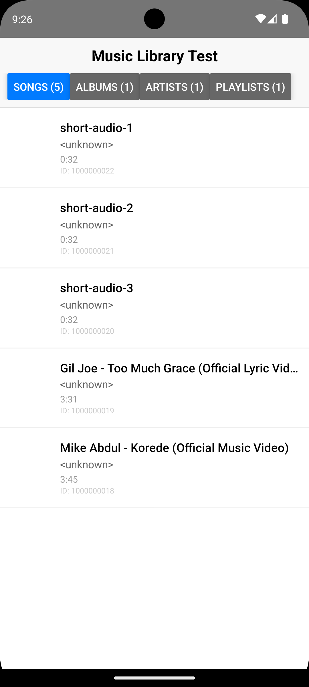

# Expo Music Library


A powerful Expo native module that provides seamless access to the device's music library, enabling you to read and retrieve audio files, albums, artists, folders, and genres in your React Native applications.

## 📱 Screenshots

|                   IOS                    |                     Android                      |
| :--------------------------------------: | :----------------------------------------------: |
|  |  |

## ✨ Features

- 🎵 **Comprehensive Music Access**: Retrieve audio files, albums, artists, folders, and genres with full metadata
- 🔍 **Full-text Search**: Search assets by title, artist, or album name
- 📄 **Pagination Everywhere**: Cursor-based pagination for all asset queries
- 🎛️ **Advanced Filtering**: Filter by artist, genre, date range, and more in `getAssetsAsync`
- 🗂️ **Sort by Title, Artist, Album**: New sort keys beyond time and duration
- 🔔 **Real-time Change Listener**: Get notified when the music library changes
- 🆔 **Get Asset by ID**: Look up a single track directly by its ID
- 📊 **Accurate Asset Counts**: `assetCount` on genres and folders reflects actual song count
- 📱 **Cross-Platform**: Full support for Android and iOS
- 🔧 **TypeScript First**: Complete type definitions with IntelliSense support

## 🚀 Platform Support

| Platform      | Android | iOS Device | iOS Simulator | Web | Expo Go |
| ------------- | :-----: | :--------: | :-----------: | :-: | :-----: |
| **Supported** |   ✅    |     ✅     |      ✅       | ❌  |   ❌    |

**Requirements:**

- ✅ **Expo SDK 55** / **React Native 0.79+**
- ✅ **Expo Development Builds**
- ✅ **Vanilla React Native** (via `npx install-expo-modules`)
- ❌ **Not compatible with Expo Go** (requires custom native code)

**Minimum OS Versions:**

- **iOS**: 13.0+
- **Android**: API Level 21 (Android 5.0)+

## 📦 Installation

### Expo Projects

```bash
npx expo install expo-music-library
```

After installation, rebuild your app:

```bash
# For Android
expo run:android

# For iOS
expo run:ios
```

### Vanilla React Native Projects

This library uses the [Expo Modules API](https://docs.expo.dev/modules/overview/). To use it in a vanilla React Native project:

**Step 1 — Install Expo Modules:**

```bash
npx install-expo-modules@latest
```

This one-time setup integrates the Expo Modules runtime into your existing React Native project without requiring you to migrate to Expo.

**Step 2 — Install the library:**

```bash
npm install expo-music-library
# or
yarn add expo-music-library
```

**Step 3 — Rebuild native code:**

```bash
# Android
npx react-native run-android

# iOS (install pods first)
cd ios && pod install && cd ..
npx react-native run-ios
```

## ⚙️ Configuration

### Config Plugin (Expo Projects — Recommended)

`expo-music-library` ships with a config plugin that automatically adds all required permissions to your native project during `expo prebuild`. You never need to touch `Info.plist` or `AndroidManifest.xml` manually.

Add it to your `app.json` or `app.config.js`:

```json
{
  "expo": {
    "plugins": [
      "expo-music-library"
    ]
  }
}
```

Then rebuild your app:

```bash
expo prebuild --clean
expo run:android   # or expo run:ios
```

#### Plugin Options

| Option | Type | Default | Description |
|---|---|---|---|
| `musicLibraryPermission` | `string` | `"Allow $(PRODUCT_NAME) to access your music library."` | iOS permission string shown in the system dialog |

```json
{
  "expo": {
    "plugins": [
      [
        "expo-music-library",
        {
          "musicLibraryPermission": "$(PRODUCT_NAME) needs your music library to play songs."
        }
      ]
    ]
  }
}
```

#### What the plugin does

| Platform | Changes applied automatically |
|---|---|
| iOS `Info.plist` | Adds `NSAppleMusicUsageDescription` |
| Android `AndroidManifest.xml` | Adds `READ_MEDIA_AUDIO` (API 33+) and `READ_EXTERNAL_STORAGE` (API ≤ 32) |

### Manual Configuration (Vanilla React Native / Bare Workflow)

If you are not using `expo prebuild`, add permissions manually.

**iOS** — add to `Info.plist`:

```xml
<key>NSAppleMusicUsageDescription</key>
<string>Allow $(PRODUCT_NAME) to access your music library.</string>
```

**Android** — add to `AndroidManifest.xml`:

```xml
<!-- Required for Android 13+ (API 33+) -->
<uses-permission android:name="android.permission.READ_MEDIA_AUDIO" />

<!-- Fallback for Android 12 and below -->
<uses-permission android:name="android.permission.READ_EXTERNAL_STORAGE" />
```

## 🎯 Usage Examples

### Basic — Request Permissions & Load Songs

```javascript
import { useEffect, useState } from "react";
import { getPermissionsAsync, requestPermissionsAsync, getAssetsAsync } from "expo-music-library";

export default function MusicApp() {
  const [songs, setSongs] = useState([]);

  useEffect(() => {
    (async () => {
      const { status } = await getPermissionsAsync();
      if (status !== "granted") {
        await requestPermissionsAsync();
      }
      const result = await getAssetsAsync({ first: 50, sortBy: "title" });
      setSongs(result.assets);
    })();
  }, []);

  return /* render songs */;
}
```

### Search Songs

```javascript
import { searchAssetsAsync } from "expo-music-library";

const results = await searchAssetsAsync("Beatles", { first: 20 });
console.log(results.assets); // songs matching "Beatles" in title, artist, or album
```

### Infinite Scrolling

```javascript
import { useState, useCallback } from "react";
import { getAssetsAsync } from "expo-music-library";

export function useInfiniteMusic() {
  const [assets, setAssets] = useState([]);
  const [endCursor, setEndCursor] = useState(null);
  const [hasNextPage, setHasNextPage] = useState(true);
  const [loading, setLoading] = useState(false);

  const loadMore = useCallback(async () => {
    if (loading || !hasNextPage) return;
    setLoading(true);
    try {
      const result = await getAssetsAsync({
        first: 20,
        after: endCursor,
        sortBy: "title",
      });
      setAssets((prev) => [...prev, ...result.assets]);
      setEndCursor(result.endCursor);
      setHasNextPage(result.hasNextPage);
    } finally {
      setLoading(false);
    }
  }, [loading, hasNextPage, endCursor]);

  return { assets, loadMore, loading, hasNextPage };
}
```

### Filter by Artist or Genre

```javascript
import { getAssetsAsync } from "expo-music-library";

// Get all songs by a specific artist
const byArtist = await getAssetsAsync({ artist: "artist-id", first: 50 });

// Get all songs in a specific genre
const byGenre = await getAssetsAsync({ genre: "genre-id", first: 50 });
```

### Paginated Album / Artist / Genre Songs

```javascript
import { getAlbumAssetsAsync, getArtistAssetsAsync, getGenreAssetsAsync } from "expo-music-library";

// First page of an album's songs
const page1 = await getAlbumAssetsAsync("album-id", { first: 20, sortBy: "title" });

// Next page
const page2 = await getAlbumAssetsAsync("album-id", { first: 20, after: page1.endCursor });

// Same pattern works for artists and genres
const artistPage = await getArtistAssetsAsync("artist-id", { first: 20 });
const genrePage  = await getGenreAssetsAsync("genre-id",  { first: 20 });
```

### Real-time Change Listener

```javascript
import { useEffect } from "react";
import { addChangeListener } from "expo-music-library";

useEffect(() => {
  const subscription = addChangeListener((event) => {
    if (event.hasIncrementalChanges) {
      // Incremental update available — refresh your data
    }
  });
  return () => subscription.remove();
}, []);
```

### Get Asset by ID

```javascript
import { getAssetByIdAsync } from "expo-music-library";

const asset = await getAssetByIdAsync("12345");
console.log(asset.title, asset.artist, asset.duration);
```

## 📚 API Reference

### Permissions

#### `requestPermissionsAsync(writeOnly?: boolean): Promise<PermissionResponse>`

Requests media library permissions.

#### `getPermissionsAsync(writeOnly?: boolean): Promise<PermissionResponse>`

Checks current permission status without requesting.

```typescript
type PermissionResponse = {
  status: "granted" | "denied" | "undetermined";
  canAskAgain: boolean;
  granted: boolean;
  expires: "never" | number;
  accessPrivileges?: "all" | "limited" | "none"; // iOS only
};
```

---

### Assets

#### `getAssetsAsync(options?: AssetsOptions): Promise<PagedInfo<Asset>>`

Retrieves audio assets with filtering, sorting, and pagination.

```typescript
type AssetsOptions = {
  first?: number;           // Page size (default: 20)
  after?: AssetRef;         // Cursor from previous page's endCursor
  album?: AlbumRef;         // Filter by album ID or Album object
  artist?: ArtistRef;       // Filter by artist ID or Artist object
  genre?: GenreRef;         // Filter by genre ID or Genre object
  sortBy?: SortByValue | SortByValue[];
  createdAfter?: Date | number;
  createdBefore?: Date | number;
};
```

#### `getAssetByIdAsync(id: string): Promise<Asset>`

Gets a single asset by its ID.

#### `searchAssetsAsync(query: string, options?: AssetsOptions): Promise<PagedInfo<Asset>>`

Searches assets whose **title**, **artist**, or **album** match the query string. Accepts the same `AssetsOptions` for pagination and filtering.

---

### Albums

#### `getAlbumsAsync(): Promise<Album[]>`

Returns all albums in the music library.

#### `getAlbumAssetsAsync(albumId: string, options?: SubQueryOptions): Promise<PagedInfo<Asset>>`

Returns paginated songs from a specific album.

---

### Artists

#### `getArtistsAsync(): Promise<Artist[]>`

Returns all artists in the music library.

#### `getArtistAssetsAsync(artistId: string, options?: SubQueryOptions): Promise<PagedInfo<Asset>>`

Returns paginated songs by a specific artist.

---

### Genres

#### `getGenresAsync(): Promise<Genre[]>`

Returns all genres in the music library with accurate song counts.

#### `getGenreAssetsAsync(genreId: string, options?: SubQueryOptions): Promise<PagedInfo<Asset>>`

Returns paginated songs in a specific genre.

---

### Folders

#### `getFoldersAsync(): Promise<Folder[]>`

Returns all folders that contain audio files, with accurate song counts.

#### `getFolderAssetsAsync(folderId: string, options?: SubQueryOptions): Promise<PagedInfo<Asset>>`

Returns paginated songs in a specific folder.

---

### Change Listener

#### `addChangeListener(listener: (event: ChangeEventPayload) => void): { remove: () => void }`

Subscribes to music library change events. Returns a subscription object with a `remove()` method.

```typescript
type ChangeEventPayload = {
  hasIncrementalChanges: boolean;
};
```

---

## 📐 Type Reference

### `Asset`

```typescript
type Asset = {
  id: string;
  filename: string;
  title: string;
  artist: string;
  artwork?: string;       // URI to album artwork (may be undefined)
  uri: string;            // assets://* (iOS), file://* (Android)
  mediaType: "audio";
  width: number;
  height: number;
  creationTime: number;
  modificationTime: number;
  duration: number;       // seconds
  albumId?: string;
  artistId?: string;
  genreId?: string;
};
```

### `Album`

```typescript
type Album = {
  id: string;
  title: string;
  assetCount: number;     // total tracks in library from this album
  albumSongs: number;     // tracks across all albums
  artist: string;
  artwork: string;
};
```

### `Artist`

```typescript
type Artist = {
  id: string;
  title: string;
  assetCount: number;
  albumSongs: number;
};
```

### `Genre`

```typescript
type Genre = {
  id: string;
  title: string;
  assetCount: number;     // actual number of songs in this genre
};
```

### `Folder`

```typescript
type Folder = {
  id: string;
  title: string;
  assetCount: number;     // number of audio files in this folder
};
```

### `PagedInfo<T>`

```typescript
type PagedInfo<T> = {
  assets: T[];
  endCursor: string;      // pass as `after` to get next page
  hasNextPage: boolean;
  totalCount: number;
};
```

### `SubQueryOptions`

Used by `getAlbumAssetsAsync`, `getArtistAssetsAsync`, `getGenreAssetsAsync`, and `getFolderAssetsAsync`.

```typescript
type SubQueryOptions = {
  first?: number;                        // Page size (default: 20)
  after?: string;                        // Cursor from previous endCursor
  sortBy?: SortByValue | SortByValue[];  // Sort order
};
```

### `SortByValue`

```typescript
type SortByKey =
  | "default"
  | "creationTime"
  | "modificationTime"
  | "duration"
  | "title"
  | "artist"
  | "album";

// A key alone (descending), or a [key, ascending] tuple
type SortByValue = SortByKey | [SortByKey, boolean];
```

**Examples:**

```javascript
sortBy: "title"                          // title descending
sortBy: ["title", true]                 // title ascending
sortBy: [["artist", true], "album"]     // artist ASC, then album DESC
```

## 🔧 Troubleshooting

### Android Studio Gradle Sync Error

If you see an error like:

```
Included build '.../expo-modules-autolinking/android/expo-gradle-plugin' does not exist
```

This means your root `node_modules` has an old version of `expo-modules-autolinking`. Run `bun install` (or `npm install`) in both the project root **and** the `example/` folder to fetch the correct version for Expo SDK 55.

### iOS Simulator — No Songs

The iOS Simulator does not have a real music library. Use a physical device to test with actual music files.

### Permissions Denied on Android 13+

Ensure `READ_MEDIA_AUDIO` is listed in your manifest. The older `READ_EXTERNAL_STORAGE` permission is ignored on Android 13+ (API 33+).

## 📄 License

MIT © [fayez-nazzal](https://github.com/fayez-nazzal)
